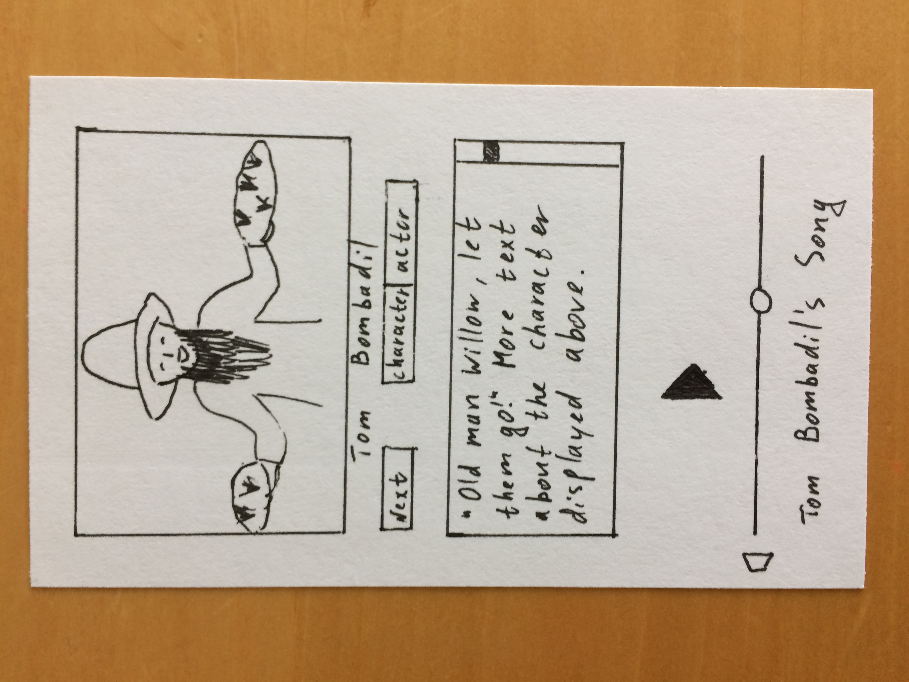

# MadingerMAD
App Dev class assignments.
- Lab1
  Create an app that presents the user with at least two buttons that change both an image and some text when tapped. Your app should be adaptive for different size classes(this includes portrait and landscape orientations and different device sizes). Don't forget to include app icons and a launch screen as well.
- Lab2
  Create an app that uses a segmented control, switch, and slider to change an image and the contents of a label including the text, text size, capitalization, and either font or text color. Your app should be adaptive for all iPhones size classes. Don't forget your app icons and launch screen.
  Problems: ran out of time to adjust the screen for large iPads.
- Lab3
  Create an app that includes multiple textfields, does a calcluation, and shows an alert or action sheet for some condition. The keyboard should be dismissed when the user taps the Done/Return key or touches the background view(hint: chapter 4 of the book) from all textfields. Your app should work for all iPhone size classes and orientation. Don't forget your app icons and launch screen.
- Project 1 Lord of the Rings IOS app
  __Description of your app including your app's inspiration and goal.__
 	This app is an exploration of Hobbit and Lord of the Rings characters. It is inspired by my daughter’s request to make her an app about the book she is currently reading and enjoying. Her requirements are the following: the app should display pictures of characters accompanied by explanatory text. It also should have some music, including her favorite Tom Bombadil’s song.

  __Define your app's intended audience. Who will be using your app? What problem is your app solving for them?__
 	The intended audience for this app is Karina – my 8-year old daughter. She loves the fact that the apps I make for the class, are just for her. She would love to have an app with the characters from the book, especially the ones that are not shown in the film. 

  __Do some research -- do similar apps exist? If so, how will yours be better or different? Research enough to know that what you're proposing is possible.__
 	There are multitudes of various apps on Lord of the Rings that do everything one can think of: games, trivia, encyclopedia, music, even learning the Elvish language. http://www.makeuseof.com/tag/6-tolkien-apps-middle-earth-obsessed/
Unfortunately, Karina is not allowed to play with the screen, unless it has to do with her school work, so none of those great apps are available to her. However, she will be allowed to help me with the project (choosing pictures and writing text) and therefore will be able to use this app. This makes my app the best in Karina’s world.
Technology-wise, it should be possible, as the only new feature that I have to learn is featuring music in the app. From a very brief Google search, I will at least be able to embed a Youtube video.

  __Where will you get any content needed for your app? This could include text, formulas, whatever your app requires.__

Here are the resources that I will need:
- images – will download from google search
- text – will be provided by my daughter
- music – will embed from Youtube or search for audio online

  __Include a digital version of your paper prototype (below)__

